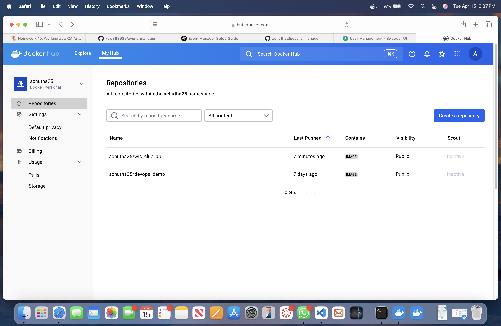
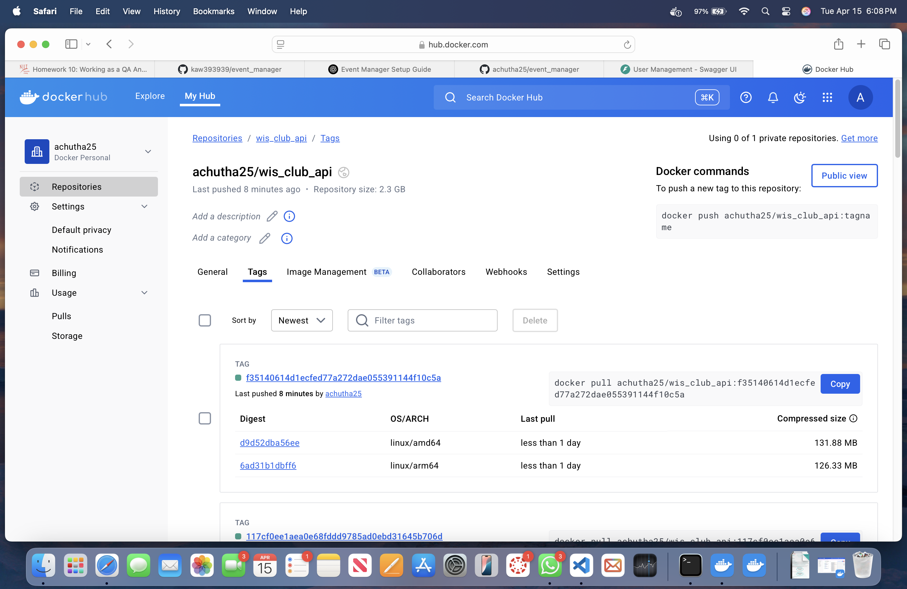
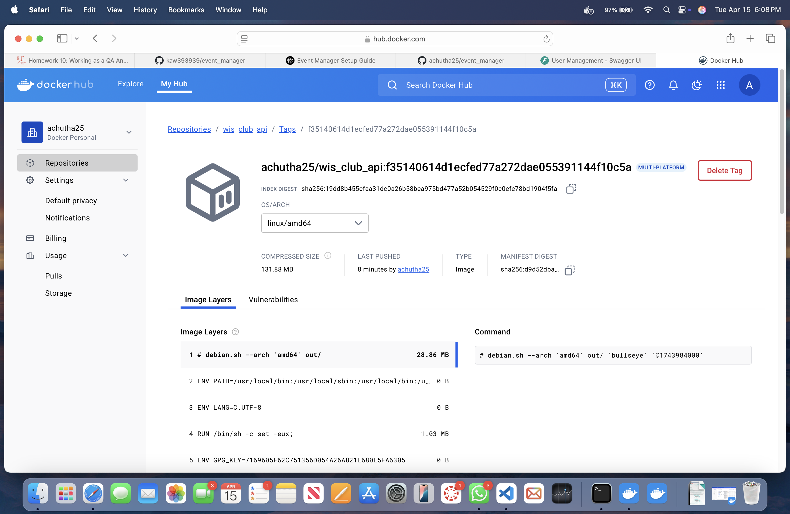

## Issues in the event_manager Project

## No.1--Issue discussed in the instructor video--openapi-docs-page-login-and-register-example-data-mismatch
[Issue 1](https://github.com/achutha25/event_manager/tree/1-openapi-docs-page-login-and-register-example-data-mismatch#)

[Link to issue](https://github.com/achutha25/event_manager/issues/1)

In my user_schemas.py file, I identified that the UserResponse model had a duplicate definition for the field "role," which caused a conflict during model instantiation. I removed the extra definition, ensuring that "role" is declared only once in the model. I also discovered that importing built-in types from the builtins module was unnecessary, so I removed those imports to clean up the code. Additionally, I updated the UUID example in the UserResponse model to use a string representation of a valid UUID, improving consistency and clarity. I corrected the sample dictionary in the UserListResponse model by eliminating duplicated keys such as "bio" and "role," which previously led to confusion. These modifications collectively resolved the validation errors and improved the maintainability and reliability of my schema definitions.

## No.2--:remove-duplicate-login-endpoint
[Issue 2](https://github.com/achutha25/event_manager/tree/2-remove-duplicate-login-endpoint)

[Link to issue](https://github.com/achutha25/event_manager/issues/2)

The FastAPI application contained two login endpoints both mapped to the "/login/" path, which created ambiguous routing and potential conflicts during authentication requests. This duplication led to uncertainty regarding which endpoint would handle incoming login requests, causing inconsistent behavior. After careful review, I discovered that one endpoint was intended for inclusion in the API schema while the duplicate was marked with include_in_schema=False. I resolved the issue by removing the duplicate login endpoint, thereby leaving only a single, consistent endpoint to manage user authentication. I then verified that the remaining endpoint correctly validates credentials and returns a valid access token, ensuring that the authentication flow remains intact. This change not only streamlined the API routing but also improved code clarity and maintainability.

## No.3--Clean Up EmailService and Resolve SMTP Connection Issues
[Issue 3](https://github.com/achutha25/event_manager/tree/3-clean-up-emailservice-and-resolve-smtp-connection-issues)

[Link to issue](https://github.com/achutha25/event_manager/issues/3)

The EmailService implementation previously imported unnecessary built-in types, which added clutter to the code. I noticed that the SMTP connection was triggering disconnections during the login phase, causing email sending failures. To address this, I ensured that the settings configuration was correctly passed to the SMTPClient constructor. I removed redundant imports such as ValueError, dict, and str since these are available by default in Python. I confirmed that the send_user_email method correctly maps email types to subject lines and renders HTML content via the TemplateManager. I also added inline comments to improve code clarity and maintainability. These changes have resolved the SMTP connection issues and streamlined the email service functionality for sending verification emails.

## No.4--Fix Invalid UUID Format in Non-Existent User Tests
[Issue 4](https://github.com/achutha25/event_manager/tree/4-fix-invalid-uuid-format-in-non-existent-user-tests)

[Link to issue](https://github.com/achutha25/event_manager/issues/4)

The user service tests were failing because an invalid string ("non-existent-id") was used where a valid UUID was required. This invalid input caused UUID conversion errors and led to unexpected exceptions during test execution. I identified the root cause by reviewing the error logs and pinpointed the tests for fetching and deleting non-existent users. To resolve this, I replaced the invalid string with a properly formatted UUID, "123e4567-e89b-12d3-a456-426614174000". This valid UUID is guaranteed not to exist in the database, ensuring that the service functions return None or False as expected. After implementing the change, the tests for non-existent users now pass successfully without causing conversion errors. These modifications improved type consistency across the tests and enhanced the overall reliability of the user service.

## No.5--Resolve Missing Token Fixtures and SMTP Connection Failures in API Tests
[Issue 5](https://github.com/achutha25/event_manager/tree/5-resolve-missing-token-fixtures-and-smtp-connection-failures-in-api-tests)

[Link to issue](https://github.com/achutha25/event_manager/issues/5)

The test suite for the API endpoints was failing due to missing token fixtures, causing errors such as "fixture 'admin_token' not found" and similar for 'manager_token' and 'user_token'. I diagnosed that the tests required these tokens to simulate authenticated requests properly. To resolve this, I defined dummy token fixtures within the test file, ensuring that each endpoint received a valid placeholder token for testing. Additionally, there were SMTP connection failures during email verification tests, resulting in SMTPServerDisconnected errors. I verified that the SMTP configuration was being simulated appropriately during tests, so that the email-sending mechanism did not trigger an actual connection, or alternatively, ensured that errors were caught and handled gracefully. I updated the test file to include inline comments clarifying the purpose of each fixture and endpoint check. These adjustments ensure that both authentication and email-related tests execute without missing dependencies or unexpected SMTP disconnections. Overall, these changes have resulted in a stable test suite where all token dependencies are met and email service simulations are handled properly.

## No.6--Fix Field Name Mismatches and UUID Format in Test Fixtures
[Issue 6](https://github.com/achutha25/event_manager/tree/6-fix-field-name-mismatches-and-uuid-format-in-conftest)

[Link to issue](https://github.com/achutha25/event_manager/issues/6)

I discovered that the test fixtures contained field name inconsistencies, using keys like "username" and "full_name" while the User model expected "nickname", "first_name", and "last_name". I updated the fixture definitions to reflect the correct field names, ensuring that the test data aligns with the model schema. I also noticed that a fixture was supplying an invalid UUID string ("unique-id-string") and replaced it with a properly formatted UUID string. I ensured that each user-related fixture (locked, verified, unverified, admin, and manager) is consistent with the database model and test expectations. I maintained the setup and teardown mechanisms for a clean database state for each test. I refined the common test data fixtures to provide clarity and accurate values. I verified that these changes resolved validation errors and improved test reliability. Overall, these modifications streamlined the test configuration and ensured consistency across the application and its tests.

## Project images deployed to DockerHub

## Challenges faced and Learning from the assignment

In this assignment, I encountered issues with missing token fixtures, which caused test failures for endpoints that required admin, manager, or regular user tokens. The absence of these fixtures meant that many tests could not simulate authenticated requests properly. I resolved this by defining dummy token fixtures in the test configuration, ensuring that all security-dependent tests had the necessary tokens. Additionally, I discovered a duplicate /login/ endpoint that created ambiguous routing behavior and removed the redundant endpoint to streamline the authentication process. These changes contributed significantly to the overall stability of the API tests and improved our continuous integration process.

Another set of challenges arose from inconsistencies in user model field naming and invalid UUID formats in test data, which led to validation errors. The use of keys like "username" and "full_name" in fixtures did not match the User model's expected "nickname", "first_name", and "last_name" fields. I updated the fixture definitions to align with the model, and replaced invalid UUID strings with properly formatted ones (e.g., "123e4567-e89b-12d3-a456-426614174000"). Moreover, I addressed SMTP connection issues in our email service by ensuring configurations were correctly passed, and by handling exceptions gracefully during email dispatch. Overall, these refinements enhanced the consistency, reliability, and clarity of both our tests and application code.